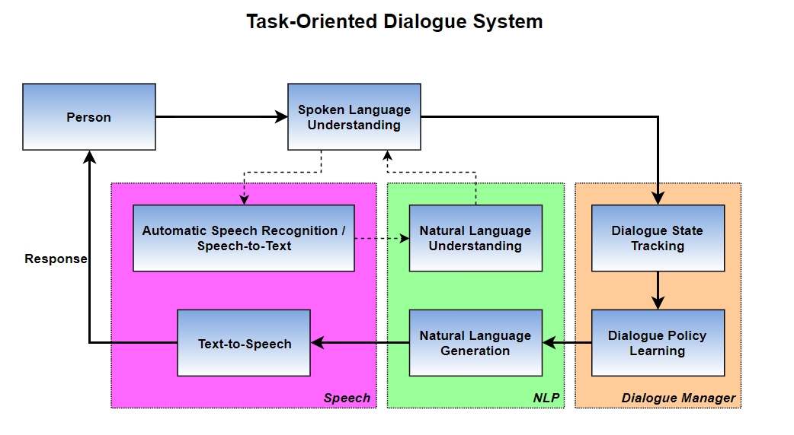
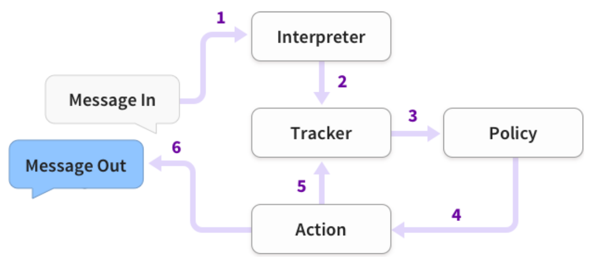
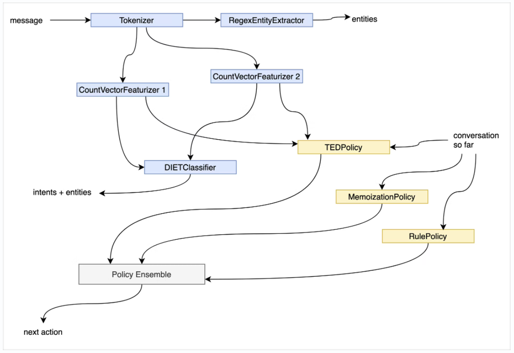
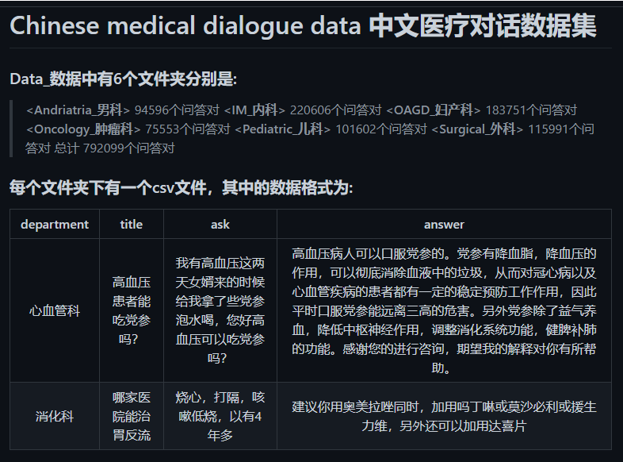
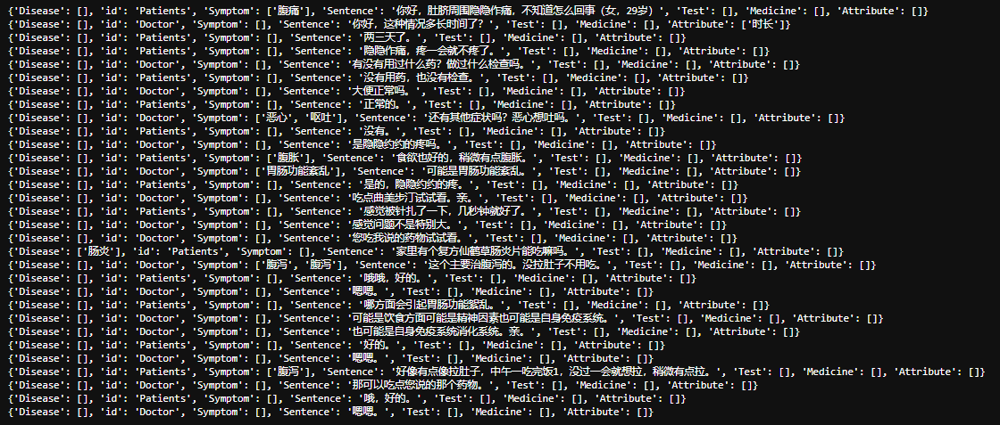
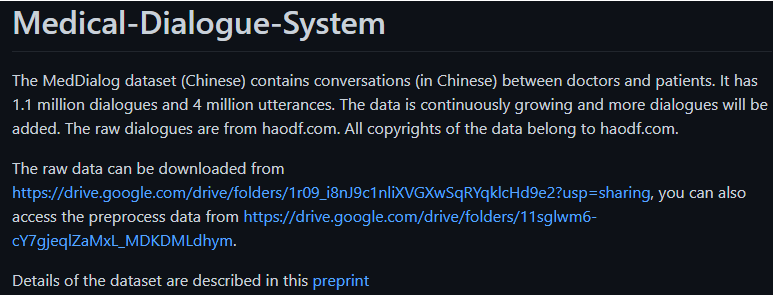
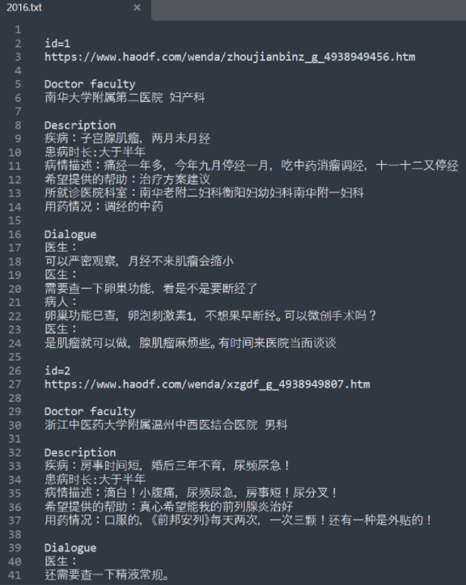
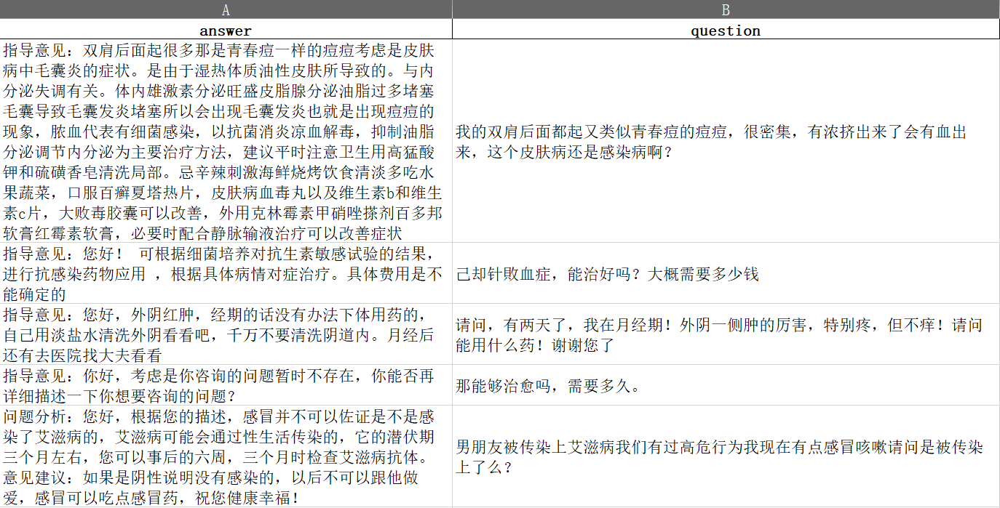
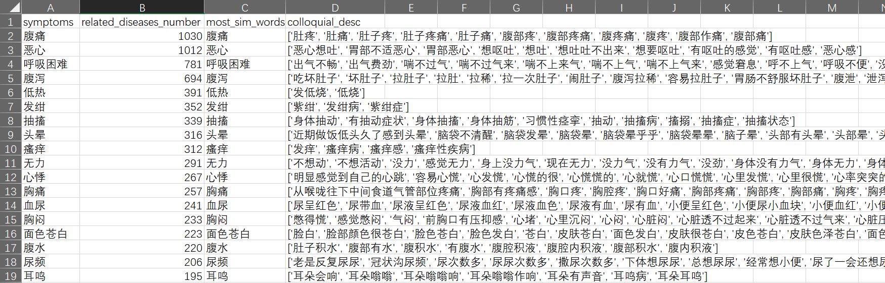
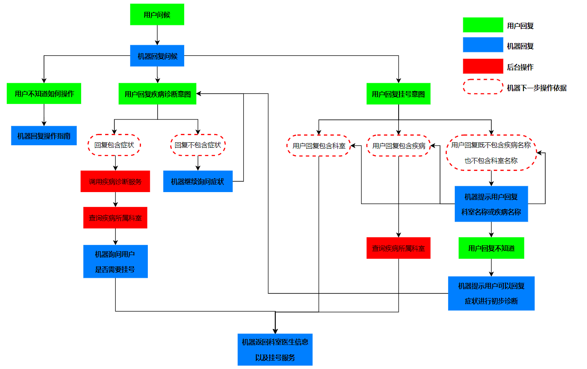

# 任务型对话系统 Task-Oriented Dialogue System
 

- 当前需求： 
  1. 按住Space键说话，录制音频，并保存本地
  2. 上传本地音频到讯飞平台，调用API获取语音听写结果
  3. 将听写结果调用RASA的API进入多轮对话管理流程，并将每轮对话的结果放进redis缓存字段
  4. 开启一线程监听redis缓存字段，当该字段不为空时，马上pop文本来并调用讯飞语音生成的API接口返回音频文件
  5. 播放本地音频文件
    
-------------------------------

## 1. 语音识别 Speech recognition

又称Automatic Speech Recognition（ASR）或称 Speech-to-Text（STT），将语音信号转为文本信息。
     
- 现有产品
   - 科大讯飞 [讯飞开放平台](https://www.xfyun.cn/)
     - `语音听写`将短音频（≤60秒）精准识别成文字，除中文普通话和英文外，支持51个语种、24种方言和1个民族语言，实时返回结果，达到边说边返回的效果。 [WebAPI文档](https://www.xfyun.cn/doc/asr/voicedictation/API.html)
          - Python3 demo -> `./asr/iat_ws_python3.py`
     - `语音转写`（Long Form ASR）是基于深度全序列卷积神经网络，可批量将音频文件（5小时以内）转换成文本数据，适用于语音质检、会议访谈等场景。 [WebAPI文档](https://www.xfyun.cn/doc/asr/lfasr/API.html)
          - Python3 demo -> `./asr/weblfasr_python3_demo.py `
          - 注意：如果出现requests模块报错："NoneType" object has no attribute 'read', 请尝试将requests模块更新到2.20.0或以上版本(本demo测试版本为2.20.0)
     - `实时语音转写`（Real-time ASR）可将不限时长的音频流实时识别为文字，并返回带有时间戳的文字流，新增翻译功能，适用于跨语种会议、国际赛事直播等多言语场景。 [WebAPI文档](https://www.xfyun.cn/doc/asr/rtasr/API.html)
          - Python3 demo -> `./asr/rtasr_python3_demo.py`
          - 注意：需要额外申请开通
-------------------------------

## 2. 自然语言理解 Natural Language Understanding

* 对文本信息进行解析，转换成计算机可以理解的结构化语义表示。整个 NLU 部分功能均使用 RASA 框架替代。RASA 是一个用于自动文本和基于语音的对话的开源机器学习框架，支持多种语言，内置支持 Spacy、MITIE、Jieba 等多种开源 NLP 工具，可将各种组件进行组合配置，构造定制化的 NLP Pipeline 以便适合需求。 
* RASA 配套了 RASA NLU 和 RASA Core，RASA NLU 用于实体提取和意图识别； RASA Core 是会话引擎，它用真实的对话文本和机器学习算法训练得到模型，从而预测在收到消息后机器人该作何回复（动作）。
* RASA 有封装好的服务器 Server 程序，运行 Server 后，可以使用 Http API 来调用功能。 下图是RASA架构机器人消息相应流程。
 
  
* RASA的NLU工作流包括初始化、分词、特征抽取、命名实体识别、意图识别和结构化输出。 
 

### 2.1 开源数据搜集
* Chinese medical dialogue data 中文医疗对话数据集 https://github.com/Toyhom/Chinese-medical-dialogue-data  
  数据在GPU集群的存放地址：/opt/data/private/task-oriented-dialogue-system-for-smart-follow-up/data/Chinese-medical-dialogue-data-master  
   
  
* ICLR 2021 Workshop: Machine Learning for Preventing and Combating Pandemics https://mlpcp21.github.io/pages/challenge  
  数据在GPU集群的存放地址：/opt/data/private/task-oriented-dialogue-system-for-smart-follow-up/data/iclr2021Workshop  
  该比赛有两个数据集： 
  （1）MedDG，大规模中文医疗对话数据集，包含超过17K个对话，涉及12种常见胃肠道疾病，并提供了精细的实体级别标注。下图是训练数据中第一个对话数据列表，每个对话列表的元素都是一个字典 
   
  （2）Medical Diagnosis Dialogue dataset（MDD），在与患者对话过程中，收集患者除自我报告以外的其它症状，并自动做出疾病诊断，MDD包括12种疾病，118种症状，总计2374个对话数据，全英文。下图是训练数据样貌。 
   

* Medical-Dialogue-System https://github.com/UCSD-AI4H/Medical-Dialogue-System  
  数据在GPU集群的存放地址：/opt/data/private/task-oriented-dialogue-system-for-smart-follow-up/data/Medical-Dialogue-Dataset-Chinese  
 
 
  
* MedicalQAQA.csv数据(约900多兆)

  
* 现有数据能对应上OMAHA术语表的症状及对应口语化描述列表

### 2.2 Neo4j 知识图谱设计
* 实体列表
  
    | ENG | CHN |
    | :---: | :---: |
    | symptom | 症状 | 
    | disease | 疾病 | 
    | medicine | 药品 | 
    | department | 科室 | 
    | food | 食物 | 
    | examination | 检查项目 |
  
* 属性列表
    * 症状
      
        | 属性 | 含义 | 举例 |
        | :---: | :---: | :---: |
        | name | 症状名称 | "发热" |
    
    * 疾病
      
        | 属性 | 含义 | 举例 |
        | :---: | :---: | :---: |
        | name | 疾病名称 | "腮腺炎" |
        | intro | 疾病介绍 | "腮腺炎是一种...疾病，..." |
        | cause | 疾病起因 | "导致腮腺炎的因素包括..." |
        | prevent | 疾病预防 | "腮腺炎的预防包括..." |
        | easy_to_get | 易感人群 | "腮腺炎多见于...人群" |
        | cure_time | 治疗时间 | "腮腺炎发病一般需要...的治疗时间" |
        | treatment | 治疗方式 | "药物治疗" |

    * 药品
      
        | 属性 | 含义 | 举例 |
        | :---: | :---: | :---: |
        | name | 药物名称 | "利培酮片" |
        | shape | 药品状态 | "片剂"或"胶囊" |
        | does | 单片剂量 | "1mg/片" |
        | dosage | 每次用量 | "每次1-3片" |
        | use_frequency | 用药频率 | "每日2次" |

    * 科室
      
        | 属性 | 含义 | 举例 |
        | :---: | :---: | :---: |
        | name | 科室名称 | "神经外科" |

    * 食物
      
        | 属性 | 含义 | 举例 |
        | :---: | :---: | :---: |
        | name | 食物名称 | "土豆" |

    * 检查项目
      
        | 属性 | 含义 | 举例 |
        | :---: | :---: | :---: |
        | name | 项目名称 | "胃镜" |

* 关系列表
  
    | 关系类型 | 含义 | 三元组举例 |
    | :---: | :---: | :---: |
    | has_symptom | 有症状 | ("糖尿病", "有", "尿液发白") |
    | has_main_symptom | 有主要症状 | ("糖尿病", "主要症状有", "多尿、口渴多饮") |
    | need_check | 所需检查 | ("糖尿病", "需要做", "血糖监测") |
    | use_drug | 可用药 | ("糖尿病", "常用", "二甲双胍") |
    | belongs_to | 属于 | ("糖尿病", "属于", "内分泌科") |
    | has_complications | 有并发症 | ("糖尿病", "会并发", "糖尿病肾小球硬化症") |
    | can_eat | 可以吃 | ("糖尿病", "宜吃", "玉米") |
    | can_not_eat | 不能吃 | ("糖尿病", "忌吃", "肥肉") |
    | caused_by | 由...引起 | ("糖尿病", "是由于", "肥肉") |
    | composed_of | 由...组成 | ("", "组成成分包括", "") |
    | apply_to_sym | 药物适用于...症状(或疾病) | ("", "适用于", "") |
    | apply_to_pop | 药物适用于...人群 | ("", "适用于", "") |
    | not_apply_to_sym | 药物不适用于...症状(或疾病) | ("", "不适用于", "") |
    | not_apply_to_pop | 药物不适用于...人群 | ("", "不适用于", "") |
    | not_eat_with_food | 药物禁忌食物 | ("", "忌吃", "") |
  
* 意图列表

    | id | 意图 | 含义 | 示例 |
    | :---: | :---: | :---: | :---: |
    | 1 | greet | 问候 | 你好，在吗？ |
    | 2 | exit | 退出 | 没事了。 |
    | 3 | affirm | 确认 | 是的。 |
    | 4 | deny | 否认 | 不是。 |
    | 5 | inquire_disease_symptoms | 查询疾病的相关症状 | 糖尿病有哪些症状？ |
    | 6 | disease_diagnosis | 疾病诊断 | 我拉了好几次肚子，请问是不是急性肠胃炎？ |
    | 7 | inquire_disease_causes | 查询疾病病因 | 胃炎有可能是什么因素导致的？ |
    | 8 | inquire_disease_susceptible_population | 查询疾病易感人群 | 什么人容易得肺癌？ |
    | 9 | inquire_disease_complications | 查询疾病并发症 | 乳腺炎的并发症有哪些？ |
    | 10 | inquire_disease_therapeutic_time | 查询疾病治疗周期 | 乳腺炎一般多久才能好？ |
    | 11 | inquire_disease_recommended_food | 查询疾病宜吃食物和推荐食谱 | 糖尿病吃什么好？ |
    | 12 | inquire_disease_can_eat_food | 查询疾病宜吃与忌吃食物 | 咳嗽可以吃芒果吗？ |
    | 13 | inquire_disease_food_related_info | 查询疾病宜吃食物、忌吃食物以及推荐食谱 | 糖尿病在饮食上需要注意什么？ |
    | 14 | inquire_disease_prevention | 查询疾病的预防措施 | 怎么预防新冠肺炎？ |
    | 15 | inquire_disease_recommended_drug | 查询疾病推荐药物 | 眼睛不舒服用什么眼药水比较好？ |
    | 16 | inquire_disease_drug_can_be_use | 查询药品是否适应当前疾病或症状 | 得了麦粒肿可以用左氧氟沙星眼药水吗？ |
    | 17 | inquire_disease_need_to_check | 查询疾病诊断所需检查项目 | 查胃炎需要做胃镜吗？ |
    | 18 | inquire_disease_available_treatments | 查询疾病可行的治疗方案 | 糖尿病怎么办？ |
    | 19 | inquire_disease_cure_possibility | 查询疾病治愈概率 | 白血病能痊愈吗？ |
    | 20 | inquire_disease_info | 查询疾病信息 | 慢性非萎缩性胃窦炎 |
    | 21 | inquire_examination_info | 查询检查项目信息 | 胃镜是怎么做的？用于检查什么疾病？ |
    | 22 | inquire_drug_info | 查询药物信息 | 利培酮片是什么药物？用于治疗什么疾病？ |
    | 23 | inquire_disease_department | 查询疾病所属科室 | 得了急性肠胃炎应该挂什么科室的号？ |

### 2.3 创建训练数据集

-------------------------------

## 3. 对话管理 Dialogue Manager

### 3.1 对话状态跟踪 Dialogue State Tracking
根据对话历史和NLU模块输出的语义表示，维护并更新当前的对话状态。

### 3.2 对话策略 Dialogue Policy Learning 
根据当前的对话状态执行下一步系统动作。

-------------------------------

## 4. 自然语言生成 Natural Language Generation
将对话策略输出的语义表示转换成自然语言文本。

-------------------------------

## 5. 文字转语音 Text-to-Speech

将文本信息转换为语音并输出给用户。
     
- 现有产品
   - 科大讯飞 [讯飞开放平台](https://www.xfyun.cn/)
      - `在线语音合成`将文字信息转化为声音信息，同时提供了众多极具特色的发音人（音库）供您选择，可以在 [这里](https://www.xfyun.cn/services/online_tts) 在线体验发音人效果。 [WebAPI文档](https://www.xfyun.cn/doc/tts/online_tts/API.html)
          - Python demo -> `./tts/tts_ws_python3_demo.py`